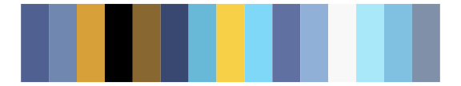

# palettetown - jirachi 

::: columns
::: {.column width="50%"}

**Github**

[timcdlucas/palettetown](https://github.com/timcdlucas/palettetown)
:::

::: {.column width="50%"}

**CRAN**

[palettetown](https://CRAN.R-project.org/package=palettetown)
:::
:::

<hr> 

Use with [paletteer](https://emilhvitfeldt.github.io/paletteer/) package:

```r
library(paletteer)
paletteer_d("palettetown::jirachi")
```

Use raw:

```r
c("#E0C050FF", "#F8E058FF", "#C8D0D8FF", "#B08830FF", "#E0E8F0FF", "#000000FF", "#80A0F8FF", "#F8F090FF", "#98A0A8FF", "#284070FF", "#687070FF", "#5070F8FF")
``` 

 

<br>

# Related Palettes

<div class="list" style="display: grid; grid-template-columns: auto auto auto;"> <figure class="figure">
<a href="../../awtools/a_palette/"> </a>
</figure> <figure class="figure">
<a href="../../palettetown/pelipper/"> </a>
</figure> <figure class="figure">
<a href="../../palettetown/walrein/"> </a>
</figure> <figure class="figure">
<a href="../../palettetown/spheal/"> </a>
</figure> <figure class="figure">
<a href="../../palettetown/seadra/"> </a>
</figure> <figure class="figure">
<a href="../../palettetown/aipom/"> </a>
</figure> <figure class="figure">
<a href="../../palettetown/wailmer/"> </a>
</figure> <figure class="figure">
<a href="../../palettetown/manectric/"> </a>
</figure> <figure class="figure">
<a href="../../palettetown/sealeo/"> </a>
</figure> <figure class="figure">
<a href="../../palettetown/shelgon/"> </a>
</figure> <figure class="figure">
<a href="../../palettetown/chimecho/"> </a>
</figure> <figure class="figure">
<a href="../../palettetown/whiscash/"> </a>
</figure> 
</div>
