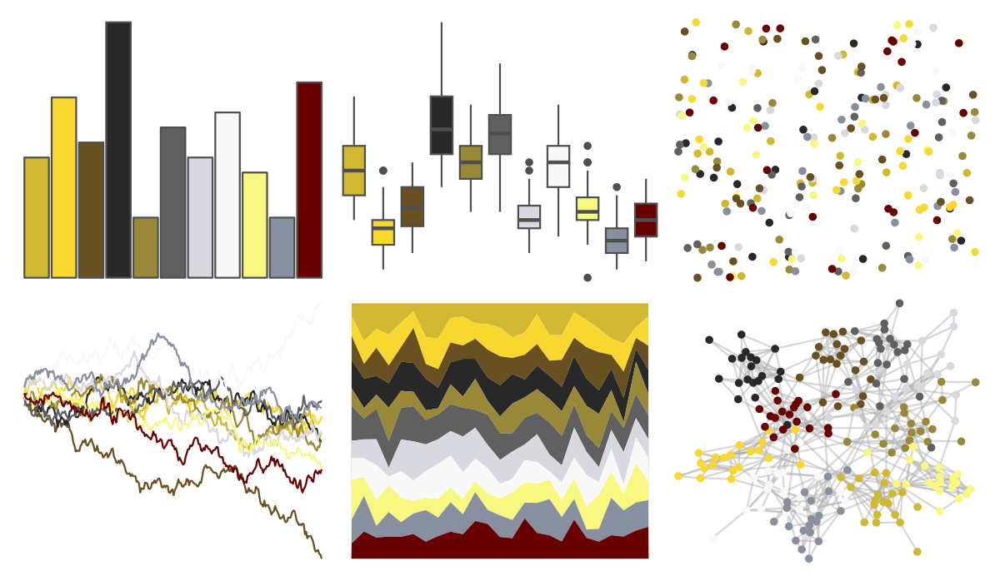
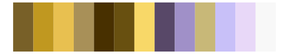

# palettetown - jolteon 

::: columns
::: {.column width="50%"}

**Github**

[timcdlucas/palettetown](https://github.com/timcdlucas/palettetown)
:::

::: {.column width="50%"}

**CRAN**

[palettetown](https://CRAN.R-project.org/package=palettetown)
:::
:::

<hr> 

Use with [paletteer](https://emilhvitfeldt.github.io/paletteer/) package:

```r
library(paletteer)
paletteer_d("palettetown::jolteon")
```

Use raw:

```r
c("#D0B830FF", "#F8D830FF", "#685020FF", "#282828FF", "#988838FF", "#606060FF", "#D8D8E0FF", "#F8F8F8FF", "#F8F880FF", "#8890A0FF", "#680000FF")
``` 

 

<br>

# Related Palettes

<div class="list" style="display: grid; grid-template-columns: auto auto auto;"> <figure class="figure">
<a href="../../amerika/Dem_Ind_Rep3/"> </a>
</figure> <figure class="figure">
<a href="../../palettetown/hitmonlee/"> </a>
</figure> <figure class="figure">
<a href="../../palettetown/furret/"> </a>
</figure> <figure class="figure">
<a href="../../palettetown/tauros/"> </a>
</figure> <figure class="figure">
<a href="../../Redmonder/dPBIYlPu/"> </a>
</figure> <figure class="figure">
<a href="../../palettetown/sandslash/"> </a>
</figure> <figure class="figure">
<a href="../../palettetown/elekid/"> </a>
</figure> <figure class="figure">
<a href="../../palettetown/wurmple/"> </a>
</figure> <figure class="figure">
<a href="../../palettetown/noctowl/"> </a>
</figure> <figure class="figure">
<a href="../../palettetown/alakazam/"> </a>
</figure> <figure class="figure">
<a href="../../palettetown/kangaskhan/"> </a>
</figure> <figure class="figure">
<a href="../../palettetown/trapinch/"> </a>
</figure> 
</div>
