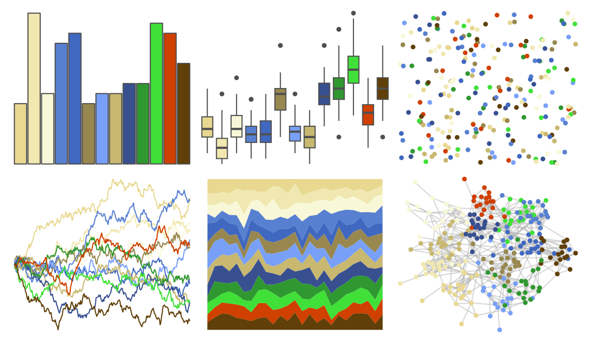
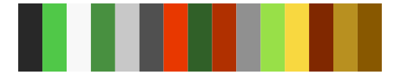
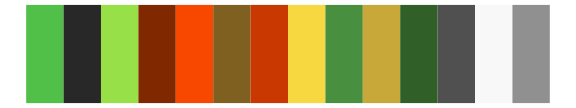

# palettetown - jumpluff 

::: columns
::: {.column width="50%"}

**Github**

[timcdlucas/palettetown](https://github.com/timcdlucas/palettetown)
:::

::: {.column width="50%"}

**CRAN**

[palettetown](https://CRAN.R-project.org/package=palettetown)
:::
:::

<hr> 

Use with [paletteer](https://emilhvitfeldt.github.io/paletteer/) package:

```r
library(paletteer)
paletteer_d("palettetown::jumpluff")
```

Use raw:

```r
c("#E8D890FF", "#F0E8B0FF", "#F8F8D8FF", "#5880D0FF", "#4068C0FF", "#988850FF", "#78A0F8FF", "#C8B870FF", "#385090FF", "#309830FF", "#40E038FF", "#D04000FF", "#604008FF")
``` 

 

<br>

# Related Palettes

<div class="list" style="display: grid; grid-template-columns: auto auto auto;"> <figure class="figure">
<a href="../../awtools/a_palette/"> </a>
</figure> <figure class="figure">
<a href="../../palettetown/yanma/"> </a>
</figure> <figure class="figure">
<a href="../../palettetown/ralts/"> </a>
</figure> <figure class="figure">
<a href="../../palettetown/meganium/"> </a>
</figure> <figure class="figure">
<a href="../../ggthemr/earth/"> </a>
</figure> <figure class="figure">
<a href="../../palettetown/chinchou/"> </a>
</figure> <figure class="figure">
<a href="../../peRReo/calle13/"> </a>
</figure> <figure class="figure">
<a href="../../ggthemr/sea/"> </a>
</figure> <figure class="figure">
<a href="../../palettetown/kirlia/"> </a>
</figure> <figure class="figure">
<a href="../../palettetown/xatu/"> </a>
</figure> <figure class="figure">
<a href="../../werpals/okavango/"> </a>
</figure> <figure class="figure">
<a href="../../palettetown/natu/"> </a>
</figure> 
</div>
