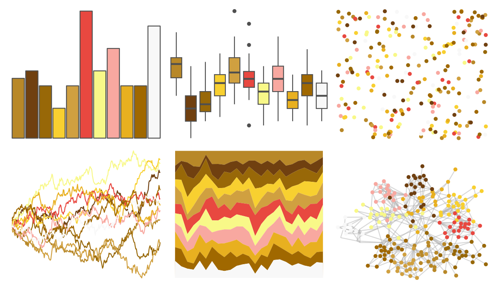

# palettetown - kabuto 

::: columns
::: {.column width="50%"}

**Github**

[timcdlucas/palettetown](https://github.com/timcdlucas/palettetown)
:::

::: {.column width="50%"}

**CRAN**

[palettetown](https://CRAN.R-project.org/package=palettetown)
:::
:::

<hr> 

Use with [paletteer](https://emilhvitfeldt.github.io/paletteer/) package:

```r
library(paletteer)
paletteer_d("palettetown::kabuto")
```

Use raw:

```r
c("#B88828FF", "#704010FF", "#986808FF", "#F8D030FF", "#D0A040FF", "#E84840FF", "#F8F888FF", "#F8A8A0FF", "#E8B020FF", "#A06800FF", "#F8F8F8FF")
``` 

 

<br>

# Related Palettes

<div class="list" style="display: grid; grid-template-columns: auto auto auto;"> <figure class="figure">
<a href="../../awtools/a_palette/"> </a>
</figure> <figure class="figure">
<a href="../../ButterflyColors/hamadryas_feronia/"> </a>
</figure> <figure class="figure">
<a href="../../ButterflyColors/hamadryas_feronia/"> </a>
</figure> <figure class="figure">
<a href="../../palettetown/persian/"> </a>
</figure> <figure class="figure">
<a href="../../palettetown/meowth/"> </a>
</figure> <figure class="figure">
<a href="../../palettetown/slowbro/"> </a>
</figure> <figure class="figure">
<a href="../../palettetown/mankey/"> </a>
</figure> <figure class="figure">
<a href="../../palettetown/paras/"> </a>
</figure> <figure class="figure">
<a href="../../palettetown/lickitung/"> </a>
</figure> <figure class="figure">
<a href="../../palettetown/krabby/"> </a>
</figure> <figure class="figure">
<a href="../../palettetown/moltres/"> </a>
</figure> <figure class="figure">
<a href="../../palettetown/fearow/"> </a>
</figure> 
</div>
