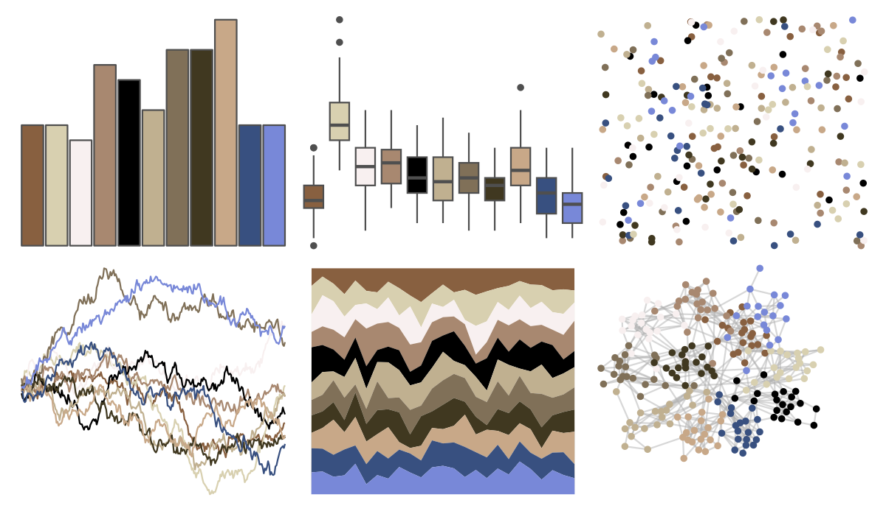
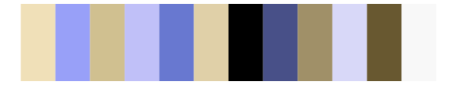

# palettetown - linoone 

::: columns
::: {.column width="50%"}

**Github**

[timcdlucas/palettetown](https://github.com/timcdlucas/palettetown)
:::

::: {.column width="50%"}

**CRAN**

[palettetown](https://CRAN.R-project.org/package=palettetown)
:::
:::

<hr> 

Use with [paletteer](https://emilhvitfeldt.github.io/paletteer/) package:

```r
library(paletteer)
paletteer_d("palettetown::linoone")
```

Use raw:

```r
c("#886040FF", "#D8D0B0FF", "#F8F0F0FF", "#A88870FF", "#000000FF", "#C0B090FF", "#807058FF", "#403820FF", "#C8A888FF", "#385080FF", "#7888D8FF")
``` 

 

<br>

# Related Palettes

<div class="list" style="display: grid; grid-template-columns: auto auto auto;"> <figure class="figure">
<a href="../../awtools/a_palette/"> </a>
</figure> <figure class="figure">
<a href="../../ButterflyColors/hamadryas_feronia/"> </a>
</figure> <figure class="figure">
<a href="../../ButterflyColors/hamadryas_feronia/"> </a>
</figure> <figure class="figure">
<a href="../../palettetown/spoink/"> </a>
</figure> <figure class="figure">
<a href="../../dutchmasters/pearl_earring/"> </a>
</figure> <figure class="figure">
<a href="../../palettetown/wailmer/"> </a>
</figure> <figure class="figure">
<a href="../../palettetown/feebas/"> </a>
</figure> <figure class="figure">
<a href="../../palettetown/spheal/"> </a>
</figure> <figure class="figure">
<a href="../../palettetown/luvdisc/"> </a>
</figure> <figure class="figure">
<a href="../../impressionist.colors/vahine_no_te_tiare/"> </a>
</figure> <figure class="figure">
<a href="../../palettetown/sealeo/"> </a>
</figure> <figure class="figure">
<a href="../../palettetown/minun/"> </a>
</figure> 
</div>
