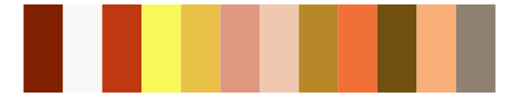
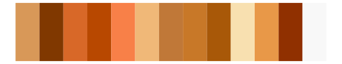

# palettetown - moltres 

::: columns
::: {.column width="50%"}

**Github**

[timcdlucas/palettetown](https://github.com/timcdlucas/palettetown)
:::

::: {.column width="50%"}

**CRAN**

[palettetown](https://CRAN.R-project.org/package=palettetown)
:::
:::

<hr> 

Use with [paletteer](https://emilhvitfeldt.github.io/paletteer/) package:

```r
library(paletteer)
paletteer_d("palettetown::moltres")
```

Use raw:

```r
c("#F8D810FF", "#F86000FF", "#F8D098FF", "#E80000FF", "#F8A800FF", "#B85000FF", "#F8F040FF", "#F89048FF", "#803000FF", "#C87820FF", "#E8A848FF", "#F8F8F8FF", "#B00000FF", "#D8D8D8FF")
``` 

 

<br>

# Related Palettes

<div class="list" style="display: grid; grid-template-columns: auto auto auto;"> <figure class="figure">
<a href="../../awtools/a_palette/"> </a>
</figure> <figure class="figure">
<a href="../../palettetown/shuckle/"> </a>
</figure> <figure class="figure">
<a href="../../palettetown/slowking/"> </a>
</figure> <figure class="figure">
<a href="../../palettetown/kabuto/"> </a>
</figure> <figure class="figure">
<a href="../../palettetown/meowth/"> </a>
</figure> <figure class="figure">
<a href="../../palettetown/charmander/"> </a>
</figure> <figure class="figure">
<a href="../../palettetown/persian/"> </a>
</figure> <figure class="figure">
<a href="../../palettetown/fearow/"> </a>
</figure> <figure class="figure">
<a href="../../palettetown/raichu/"> </a>
</figure> <figure class="figure">
<a href="../../palettetown/combusken/"> </a>
</figure> <figure class="figure">
<a href="../../palettetown/slowbro/"> </a>
</figure> <figure class="figure">
<a href="../../palettetown/vulpix/"> </a>
</figure> 
</div>
