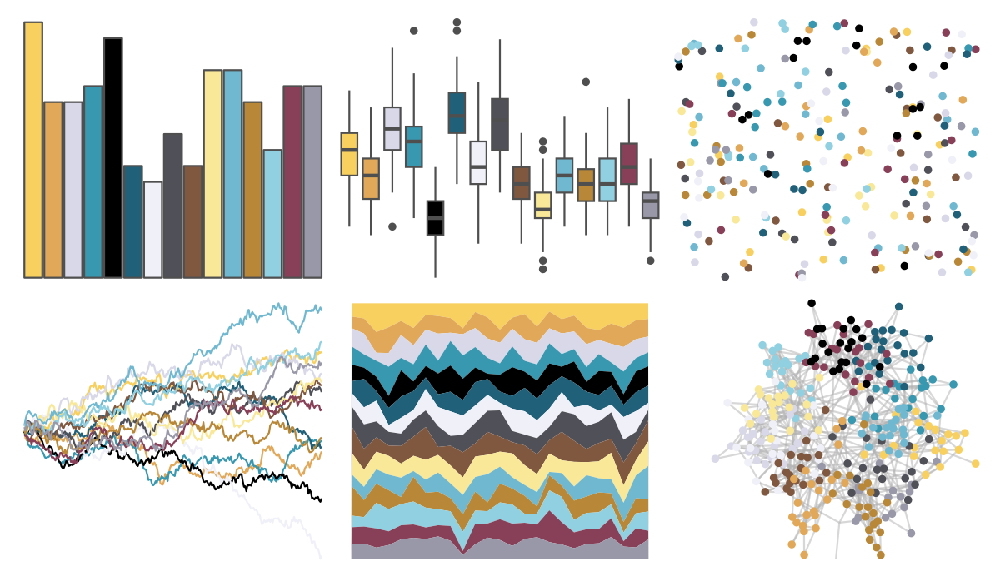

# palettetown - pelipper 

::: columns
::: {.column width="50%"}

**Github**

[timcdlucas/palettetown](https://github.com/timcdlucas/palettetown)
:::

::: {.column width="50%"}

**CRAN**

[palettetown](https://CRAN.R-project.org/package=palettetown)
:::
:::

<hr> 

Use with [paletteer](https://emilhvitfeldt.github.io/paletteer/) package:

```r
library(paletteer)
paletteer_d("palettetown::pelipper")
```

Use raw:

```r
c("#F8D060FF", "#E0A858FF", "#D8D8E8FF", "#3898B0FF", "#000000FF", "#206078FF", "#F0F0F8FF", "#505058FF", "#805840FF", "#F8E898FF", "#70B8D0FF", "#B88838FF", "#90D0E0FF", "#884058FF", "#9898A8FF")
``` 

 

<br>

# Related Palettes

<div class="list" style="display: grid; grid-template-columns: auto auto auto;"> <figure class="figure">
<a href="../../awtools/a_palette/"> </a>
</figure> <figure class="figure">
<a href="../../palettetown/jirachi/"> </a>
</figure> <figure class="figure">
<a href="../../palettetown/whiscash/"> </a>
</figure> <figure class="figure">
<a href="../../palettetown/walrein/"> </a>
</figure> <figure class="figure">
<a href="../../palettetown/sealeo/"> </a>
</figure> <figure class="figure">
<a href="../../palettetown/gyarados/"> </a>
</figure> <figure class="figure">
<a href="../../palettetown/wailmer/"> </a>
</figure> <figure class="figure">
<a href="../../palettetown/minun/"> </a>
</figure> <figure class="figure">
<a href="../../palettetown/spheal/"> </a>
</figure> <figure class="figure">
<a href="../../palettetown/volbeat/"> </a>
</figure> <figure class="figure">
<a href="../../palettetown/chimecho/"> </a>
</figure> <figure class="figure">
<a href="../../palettetown/seadra/"> </a>
</figure> 
</div>
