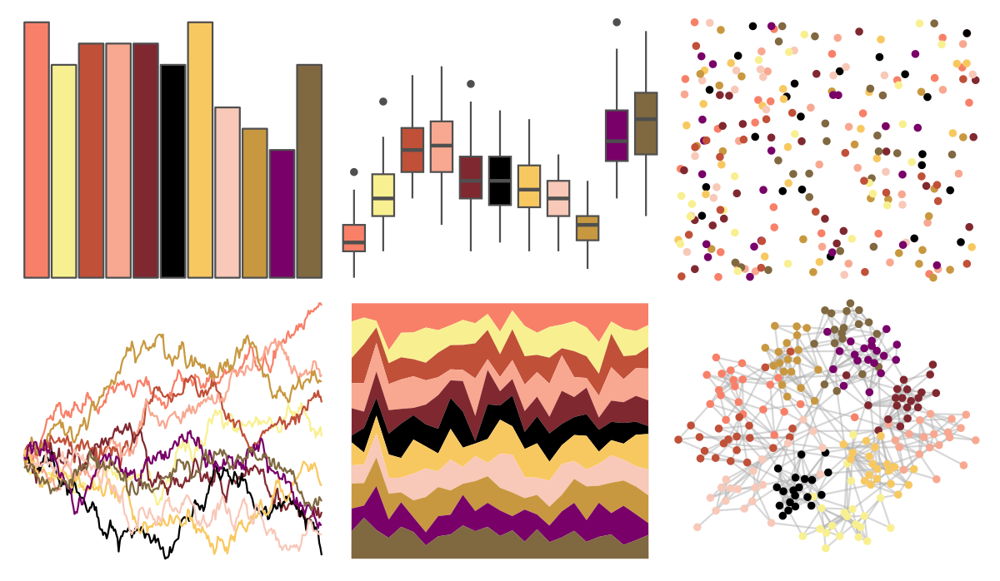

# palettetown - skitty 

::: columns
::: {.column width="50%"}

**Github**

[timcdlucas/palettetown](https://github.com/timcdlucas/palettetown)
:::

::: {.column width="50%"}

**CRAN**

[palettetown](https://CRAN.R-project.org/package=palettetown)
:::
:::

<hr> 

Use with [paletteer](https://emilhvitfeldt.github.io/paletteer/) package:

```r
library(paletteer)
paletteer_d("palettetown::skitty")
```

Use raw:

```r
c("#F88068FF", "#F8F090FF", "#C05038FF", "#F8A890FF", "#802830FF", "#000000FF", "#F8C860FF", "#F8C8B8FF", "#C89840FF", "#780068FF", "#806840FF")
``` 

 

<br>

# Related Palettes

<div class="list" style="display: grid; grid-template-columns: auto auto auto;"> <figure class="figure">
<a href="../../awtools/a_palette/"> </a>
</figure> <figure class="figure">
<a href="../../palettetown/makuhita/"> </a>
</figure> <figure class="figure">
<a href="../../palettetown/sentret/"> </a>
</figure> <figure class="figure">
<a href="../../tvthemes/spongeBob/"> </a>
</figure> <figure class="figure">
<a href="../../palettetown/blaziken/"> </a>
</figure> <figure class="figure">
<a href="../../palettetown/cyndaquil/"> </a>
</figure> <figure class="figure">
<a href="../../palettetown/smoochum/"> </a>
</figure> <figure class="figure">
<a href="../../palettetown/lileep/"> </a>
</figure> <figure class="figure">
<a href="../../palettetown/typhlosion/"> </a>
</figure> <figure class="figure">
<a href="../../palettetown/chimecho/"> </a>
</figure> <figure class="figure">
<a href="../../tvthemes/simpsons/"> </a>
</figure> <figure class="figure">
<a href="../../palettetown/minun/"> </a>
</figure> 
</div>
