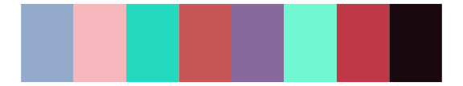

# palettetown - wynaut 

::: columns
::: {.column width="50%"}

**Github**

[timcdlucas/palettetown](https://github.com/timcdlucas/palettetown)
:::

::: {.column width="50%"}

**CRAN**

[palettetown](https://CRAN.R-project.org/package=palettetown)
:::
:::

<hr> 

Use with [paletteer](https://emilhvitfeldt.github.io/paletteer/) package:

```r
library(paletteer)
paletteer_d("palettetown::wynaut")
```

Use raw:

```r
c("#68B8D8FF", "#4898B8FF", "#284850FF", "#98D0E8FF", "#000000FF", "#3878A0FF", "#D85860FF", "#A03040FF", "#403838FF", "#782838FF", "#C8C8C0FF")
``` 

 

<br>

# Related Palettes

<div class="list" style="display: grid; grid-template-columns: auto auto auto;"> <figure class="figure">
<a href="../../awtools/a_palette/"> </a>
</figure> <figure class="figure">
<a href="../../peRReo/planb/"> </a>
</figure> <figure class="figure">
<a href="../../ggthemr/fresh/"> </a>
</figure> <figure class="figure">
<a href="../../impressionist.colors/les_nympheas_2/"> </a>
</figure> <figure class="figure">
<a href="../../palettetown/azurill/"> </a>
</figure> <figure class="figure">
<a href="../../peRReo/badgyal/"> </a>
</figure> <figure class="figure">
<a href="../../peRReo/karolg/"> </a>
</figure> <figure class="figure">
<a href="../../MetBrewer/Thomas/"> </a>
</figure> <figure class="figure">
<a href="../../palettetown/mightyena/"> </a>
</figure> <figure class="figure">
<a href="../../palettetown/altaria/"> </a>
</figure> <figure class="figure">
<a href="../../impressionist.colors/pres_du_lac/"> </a>
</figure> <figure class="figure">
<a href="../../tvthemes/Bismuth/"> </a>
</figure> 
</div>
