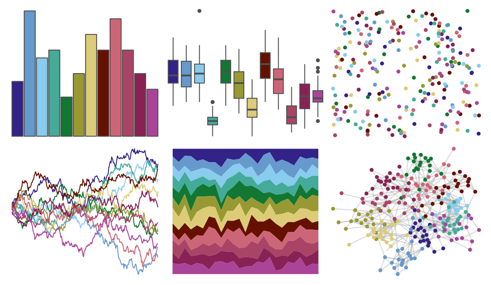
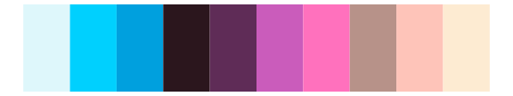
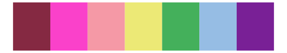

# pals - tol 

::: columns
::: {.column width="50%"}

**Github**

[kwstat/pals](https://github.com/kwstat/pals)
:::

::: {.column width="50%"}

**CRAN**

[pals](https://CRAN.R-project.org/package=pals)
:::
:::

<hr> 

Use with [paletteer](https://emilhvitfeldt.github.io/paletteer/) package:

```r
library(paletteer)
paletteer_d("pals::tol")
```

Use raw:

```r
c("#332288FF", "#6699CCFF", "#88CCEEFF", "#44AA99FF", "#117733FF", "#999933FF", "#DDCC77FF", "#661100FF", "#CC6677FF", "#AA4466FF", "#882255FF", "#AA4499FF")
``` 

 

<br>

# Related Palettes

<div class="list" style="display: grid; grid-template-columns: auto auto auto;"> <figure class="figure">
<a href="../../awtools/a_palette/"> </a>
</figure> <figure class="figure">
<a href="../../khroma/muted/"> </a>
</figure> <figure class="figure">
<a href="../../MetBrewer/Manet/"> </a>
</figure> <figure class="figure">
<a href="../../jcolors/pal8/"> </a>
</figure> <figure class="figure">
<a href="../../tvthemes/Steven/"> </a>
</figure> <figure class="figure">
<a href="../../beyonce/X18/"> </a>
</figure> <figure class="figure">
<a href="../../nationalparkcolors/GeneralGrant/"> </a>
</figure> <figure class="figure">
<a href="../../DresdenColor/briefcases/"> </a>
</figure> <figure class="figure">
<a href="../../beyonce/X66/"> </a>
</figure> <figure class="figure">
<a href="../../tvthemes/Alexandrite/"> </a>
</figure> <figure class="figure">
<a href="../../werpals/provence/"> </a>
</figure> <figure class="figure">
<a href="../../vapoRwave/hyperBubble/"> </a>
</figure> 
</div>
