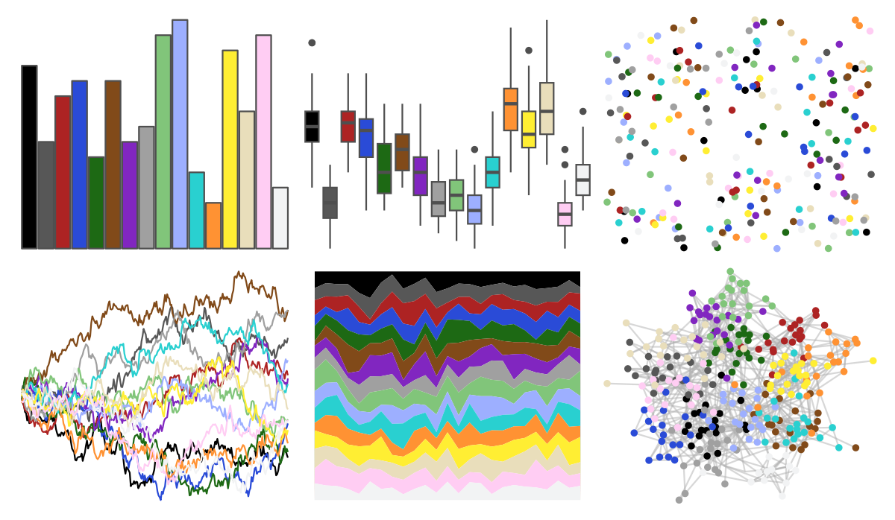
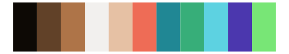

# pals - watlington 

::: columns
::: {.column width="50%"}

**Github**

[kwstat/pals](https://github.com/kwstat/pals)
:::

::: {.column width="50%"}

**CRAN**

[pals](https://CRAN.R-project.org/package=pals)
:::
:::

<hr> 

Use with [paletteer](https://emilhvitfeldt.github.io/paletteer/) package:

```r
library(paletteer)
paletteer_d("pals::watlington")
```

Use raw:

```r
c("#000000FF", "#575757FF", "#AD2323FF", "#2A4BD7FF", "#1D6914FF", "#814A19FF", "#8126C0FF", "#A0A0A0FF", "#81C57AFF", "#9DAFFFFF", "#29D0D0FF", "#FF9233FF", "#FFEE33FF", "#E9DEBBFF", "#FFCDF3FF", "#F2F3F4FF")
``` 

 

<br>

# Related Palettes

<div class="list" style="display: grid; grid-template-columns: auto auto auto;"> <figure class="figure">
<a href="../../amerika/Dem_Ind_Rep3/"> </a>
</figure> <figure class="figure">
<a href="../../palettesForR/Android/"> </a>
</figure> <figure class="figure">
<a href="../../ggthemr/copper/"> </a>
</figure> <figure class="figure">
<a href="../../palettetown/crawdaunt/"> </a>
</figure> <figure class="figure">
<a href="../../palettetown/gyarados/"> </a>
</figure> <figure class="figure">
<a href="../../palettetown/delcatty/"> </a>
</figure> <figure class="figure">
<a href="../../palettetown/swellow/"> </a>
</figure> <figure class="figure">
<a href="../../palettetown/exploud/"> </a>
</figure> <figure class="figure">
<a href="../../awtools/bpalette/"> </a>
</figure> <figure class="figure">
<a href="../../palettetown/huntail/"> </a>
</figure> <figure class="figure">
<a href="../../RColorBrewer/PuOr/"> </a>
</figure> <figure class="figure">
<a href="../../tidyquant/tq_light/"> </a>
</figure> 
</div>
