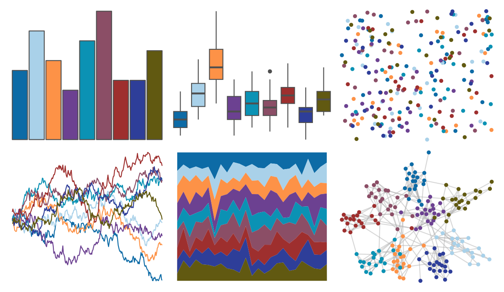
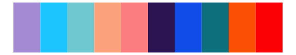

# peRReo - badbunny1 

::: columns
::: {.column width="50%"}

**Github**

[jbgb13/peRReo](https://github.com/jbgb13/peRReo)
:::

::: {.column width="50%"}

**CRAN**

Not on CRAN
:::
:::

<hr> 

Use with [paletteer](https://emilhvitfeldt.github.io/paletteer/) package:

```r
library(paletteer)
paletteer_d("peRReo::badbunny1")
```

Use raw:

```r
c("#0D6BA6FF", "#A9D1E9FF", "#FD9247FF", "#6C4191FF", "#0B92B4FF", "#8B4E66FF", "#9E2F2EFF", "#2E3E99FF", "#615911FF")
``` 

 

<br>

# Related Palettes

<div class="list" style="display: grid; grid-template-columns: auto auto auto;"> <figure class="figure">
<a href="../../amerika/Dem_Ind_Rep3/"> </a>
</figure> <figure class="figure">
<a href="../../MetBrewer/Moreau/"> </a>
</figure> <figure class="figure">
<a href="../../peRReo/karolg/"> </a>
</figure> <figure class="figure">
<a href="../../peRReo/rauw/"> </a>
</figure> <figure class="figure">
<a href="../../PrettyCols/Celestial/"> </a>
</figure> <figure class="figure">
<a href="../../ggprism/prism_light2/"> </a>
</figure> <figure class="figure">
<a href="../../ggprism/prism_dark/"> </a>
</figure> <figure class="figure">
<a href="../../ggsci/planetexpress_futurama/"> </a>
</figure> <figure class="figure">
<a href="../../feathers/blue_winged_kookaburra/"> </a>
</figure> <figure class="figure">
<a href="../../miscpalettes/dreaming/"> </a>
</figure> <figure class="figure">
<a href="../../werpals/uyuni/"> </a>
</figure> <figure class="figure">
<a href="../../peRReo/planb/"> </a>
</figure> 
</div>
