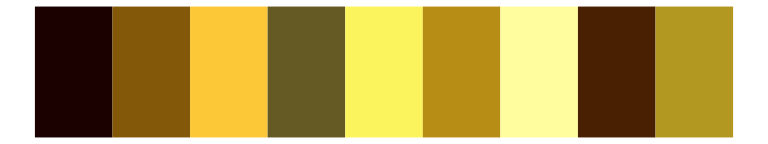

# peRReo - daddy2 

::: columns
::: {.column width="50%"}

**Github**

[jbgb13/peRReo](https://github.com/jbgb13/peRReo)
:::

::: {.column width="50%"}

**CRAN**

Not on CRAN
:::
:::

<hr> 

Use with [paletteer](https://emilhvitfeldt.github.io/paletteer/) package:

```r
library(paletteer)
paletteer_d("peRReo::daddy2")
```

Use raw:

```r
c("#1B0100FF", "#835809FF", "#FCC838FF", "#655A24FF", "#FCF45CFF", "#B88D15FF", "#FFFD9EFF", "#4A2003FF", "#B29721FF")
``` 

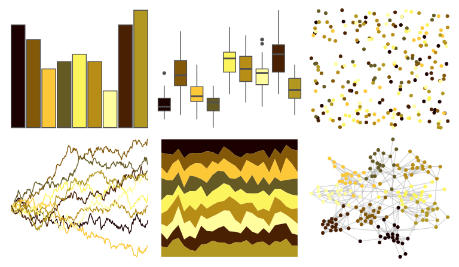 

<br>

# Related Palettes

<div class="list" style="display: grid; grid-template-columns: auto auto auto;"> <figure class="figure">
<a href="../../awtools/a_palette/"> </a>
</figure> <figure class="figure">
<a href="../../fishualize/Antennarius_multiocellatus/"> 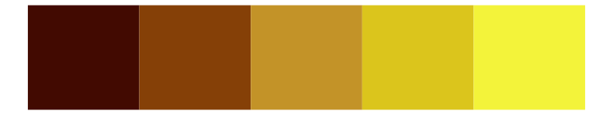</a>
</figure> <figure class="figure">
<a href="../../soilpalettes/natrudoll/"> 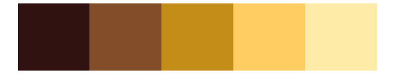</a>
</figure> <figure class="figure">
<a href="../../beyonce/X16/"> 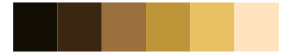</a>
</figure> <figure class="figure">
<a href="../../palettetown/abra/"> 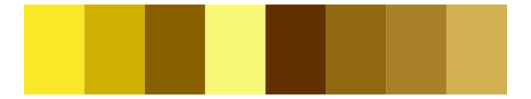</a>
</figure> <figure class="figure">
<a href="../../colRoz/a_plagiata/"> </a>
</figure> <figure class="figure">
<a href="../../fishualize/Ostracion_cubicus/"> </a>
</figure> <figure class="figure">
<a href="../../werpals/halong/"> 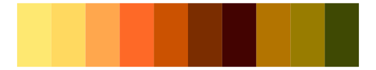</a>
</figure> <figure class="figure">
<a href="../../tvthemes/Martell/"> 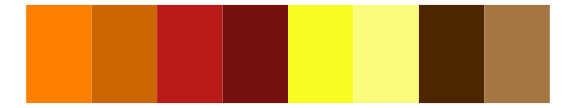</a>
</figure> <figure class="figure">
<a href="../../beyonce/X86/"> 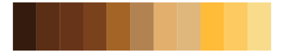</a>
</figure> <figure class="figure">
<a href="../../palettetown/hoppip/"> 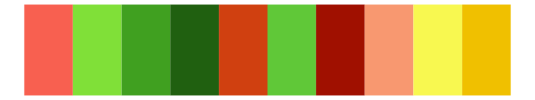</a>
</figure> <figure class="figure">
<a href="../../tvthemes/EarthKingdom/"> 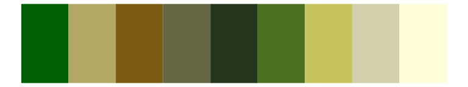</a>
</figure> 
</div>
