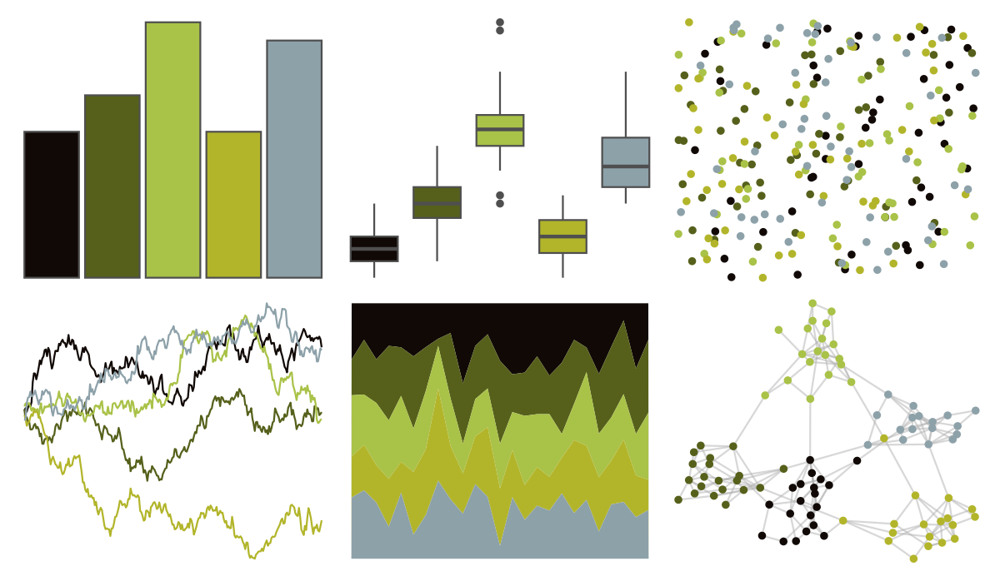

# poisonfrogs - Afulguritus 

::: columns
::: {.column width="50%"}

**Github**

[laurenoconnelllab/poisonfrogs](https://github.com/laurenoconnelllab/poisonfrogs)
:::

::: {.column width="50%"}

**CRAN**

[poisonfrogs](https://CRAN.R-project.org/package=poisonfrogs)
:::
:::

<hr> 

Use with [paletteer](https://emilhvitfeldt.github.io/paletteer/) package:

```r
library(paletteer)
paletteer_d("poisonfrogs::Afulguritus")
```

Use raw:

```r
c("#110906FF", "#56601BFF", "#A9C248FF", "#B2B52AFF", "#8DA1A9FF")
``` 

 

<br>

# Related Palettes

<div class="list" style="display: grid; grid-template-columns: auto auto auto;"> <figure class="figure">
<a href="../../amerika/Dem_Ind_Rep3/"> </a>
</figure> <figure class="figure">
<a href="../../PNWColors/Cascades/"> </a>
</figure> <figure class="figure">
<a href="../../ochRe/jumping_frog/"> </a>
</figure> <figure class="figure">
<a href="../../fishualize/Melichthys_vidua/"> </a>
</figure> <figure class="figure">
<a href="../../beyonce/X22/"> </a>
</figure> <figure class="figure">
<a href="../../yarrr/ohbrother/"> </a>
</figure> <figure class="figure">
<a href="../../ghibli/MarnieMedium2/"> </a>
</figure> <figure class="figure">
<a href="../../Manu/Hihi/"> </a>
</figure> <figure class="figure">
<a href="../../calecopal/bigsur2/"> </a>
</figure> <figure class="figure">
<a href="../../nbapalettes/timberwolves/"> </a>
</figure> <figure class="figure">
<a href="../../MoMAColors/Dali/"> </a>
</figure> <figure class="figure">
<a href="../../poisonfrogs/Rispotted/"> </a>
</figure> 
</div>
