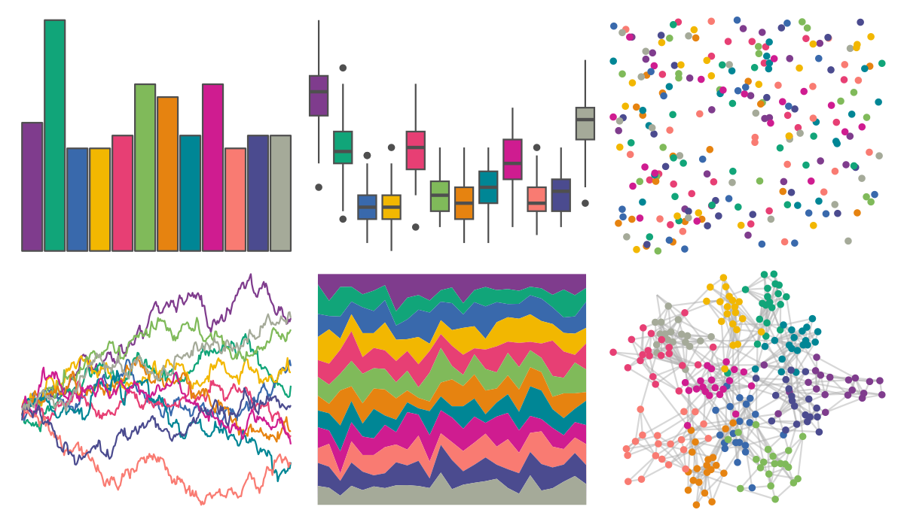

# rcartocolor - Bold 

::: columns
::: {.column width="50%"}

**Github**

[Nowosad/rcartocolor](https://github.com/Nowosad/rcartocolor)
:::

::: {.column width="50%"}

**CRAN**

[rcartocolor](https://CRAN.R-project.org/package=rcartocolor)
:::
:::

<hr> 

Use with [paletteer](https://emilhvitfeldt.github.io/paletteer/) package:

```r
library(paletteer)
paletteer_d("rcartocolor::Bold")
```

Use raw:

```r
c("#7F3C8DFF", "#11A579FF", "#3969ACFF", "#F2B701FF", "#E73F74FF", "#80BA5AFF", "#E68310FF", "#008695FF", "#CF1C90FF", "#F97B72FF", "#4B4B8FFF", "#A5AA99FF")
``` 

 

<br>

# Related Palettes

<div class="list" style="display: grid; grid-template-columns: auto auto auto;"> <figure class="figure">
<a href="../../awtools/a_palette/"> </a>
</figure> <figure class="figure">
<a href="../../rcartocolor/Vivid/"> </a>
</figure> <figure class="figure">
<a href="../../DresdenColor/paired/"> </a>
</figure> <figure class="figure">
<a href="../../MetBrewer/Signac/"> </a>
</figure> <figure class="figure">
<a href="../../rcartocolor/Prism/"> </a>
</figure> <figure class="figure">
<a href="../../MetBrewer/Cross/"> </a>
</figure> <figure class="figure">
<a href="../../ggsci/category10_d3/"> </a>
</figure> <figure class="figure">
<a href="../../ggthemes/Classic_10/"> </a>
</figure> <figure class="figure">
<a href="../../ggthemes/Classic_Cyclic/"> </a>
</figure> <figure class="figure">
<a href="../../MetBrewer/Renoir/"> </a>
</figure> <figure class="figure">
<a href="../../ggthemr/flat/"> </a>
</figure> <figure class="figure">
<a href="../../tidyquant/tq_light/"> </a>
</figure> 
</div>
