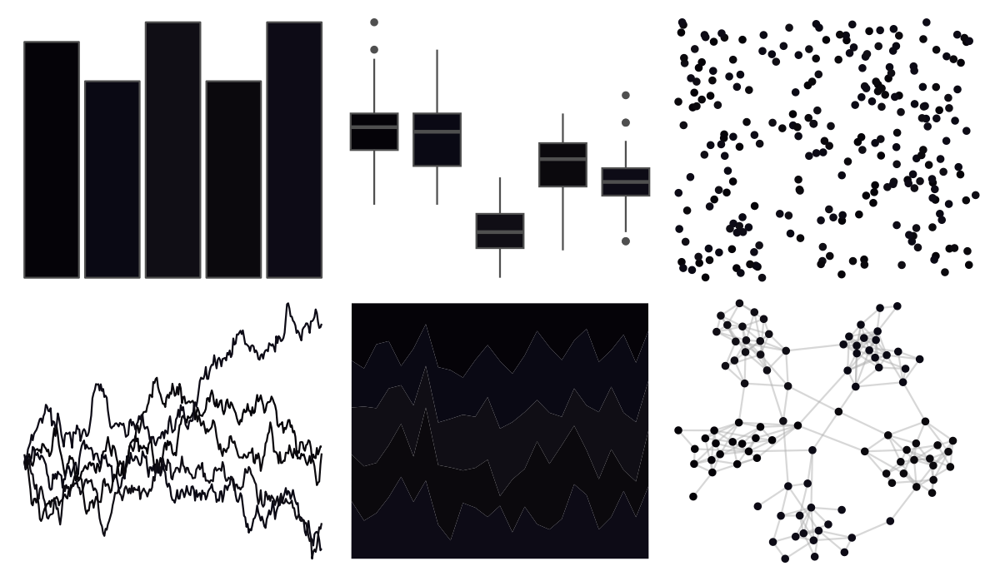

# soilpalettes - pywell 

::: columns
::: {.column width="50%"}

**Github**

[kaizadp/soilpalettes](https://github.com/kaizadp/soilpalettes)
:::

::: {.column width="50%"}

**CRAN**

Not on CRAN
:::
:::

<hr> 

Use with [paletteer](https://emilhvitfeldt.github.io/paletteer/) package:

```r
library(paletteer)
paletteer_d("soilpalettes::pywell")
```

Use raw:

```r
c("#050308FF", "#0A0914FF", "#100E15FF", "#0B090DFF", "#0D0B16FF")
``` 

 

<br>

# Related Palettes

<div class="list" style="display: grid; grid-template-columns: auto auto auto;"> <figure class="figure">
<a href="../../awtools/a_palette/"> </a>
</figure> <figure class="figure">
<a href="../../ButterflyColors/hamadryas_feronia/"> </a>
</figure> <figure class="figure">
<a href="../../ButterflyColors/hamadryas_feronia/"> </a>
</figure> <figure class="figure">
<a href="../../ghibli/TotoroDark/"> </a>
</figure> <figure class="figure">
<a href="../../beyonce/X4/"> </a>
</figure> <figure class="figure">
<a href="../../ButterflyColors/chorinea_licursis/"> </a>
</figure> <figure class="figure">
<a href="../../beyonce/X120/"> </a>
</figure> <figure class="figure">
<a href="../../nord/polarnight/"> </a>
</figure> <figure class="figure">
<a href="../../ButterflyColors/fountainea_ryphea/"> </a>
</figure> <figure class="figure">
<a href="../../beyonce/X91/"> </a>
</figure> <figure class="figure">
<a href="../../ghibli/MarnieDark2/"> </a>
</figure> <figure class="figure">
<a href="../../ghibli/KikiDark/"> </a>
</figure> 
</div>
