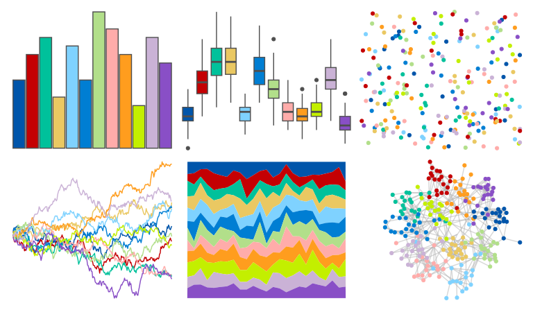

# tidyquant - tq_dark 

::: columns
::: {.column width="50%"}

**Github**

[business-science/tidyquant](https://github.com/business-science/tidyquant)
:::

::: {.column width="50%"}

**CRAN**

[tidyquant](https://CRAN.R-project.org/package=tidyquant)
:::
:::

<hr> 

Use with [paletteer](https://emilhvitfeldt.github.io/paletteer/) package:

```r
library(paletteer)
paletteer_d("tidyquant::tq_dark")
```

Use raw:

```r
c("#0055AAFF", "#C40003FF", "#00C19BFF", "#EAC862FF", "#7FD2FFFF", "#007ED3FF", "#B2DF8AFF", "#FFACAAFF", "#FF9D1EFF", "#C3EF00FF", "#CAB2D6FF", "#894FC6FF")
``` 

 

<br>

# Related Palettes

<div class="list" style="display: grid; grid-template-columns: auto auto auto;"> <figure class="figure">
<a href="../../awtools/a_palette/"> </a>
</figure> <figure class="figure">
<a href="../../RColorBrewer/Paired/"> </a>
</figure> <figure class="figure">
<a href="../../basetheme/deepblue/"> </a>
</figure> <figure class="figure">
<a href="../../tidyquant/tq_green/"> </a>
</figure> <figure class="figure">
<a href="../../tidyquant/tq_light/"> </a>
</figure> <figure class="figure">
<a href="../../RColorBrewer/Spectral/"> </a>
</figure> <figure class="figure">
<a href="../../ggthemr/flat_dark/"> </a>
</figure> <figure class="figure">
<a href="../../basetheme/dark/"> </a>
</figure> <figure class="figure">
<a href="../../trekcolors/lcars_2357/"> </a>
</figure> <figure class="figure">
<a href="../../basetheme/brutal/"> </a>
</figure> <figure class="figure">
<a href="../../Redmonder/qMSOSlp/"> </a>
</figure> <figure class="figure">
<a href="../../tvthemes/rickAndMorty/"> </a>
</figure> 
</div>
