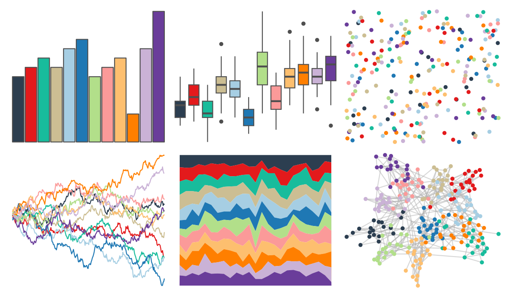

# tidyquant - tq_light 

::: columns
::: {.column width="50%"}

**Github**

[business-science/tidyquant](https://github.com/business-science/tidyquant)
:::

::: {.column width="50%"}

**CRAN**

[tidyquant](https://CRAN.R-project.org/package=tidyquant)
:::
:::

<hr> 

Use with [paletteer](https://emilhvitfeldt.github.io/paletteer/) package:

```r
library(paletteer)
paletteer_d("tidyquant::tq_light")
```

Use raw:

```r
c("#2C3E50FF", "#E31A1CFF", "#18BC9CFF", "#CCBE93FF", "#A6CEE3FF", "#1F78B4FF", "#B2DF8AFF", "#FB9A99FF", "#FDBF6FFF", "#FF7F00FF", "#CAB2D6FF", "#6A3D9AFF")
``` 

 

<br>

# Related Palettes

<div class="list" style="display: grid; grid-template-columns: auto auto auto;"> <figure class="figure">
<a href="../../amerika/Dem_Ind_Rep3/"> </a>
</figure> <figure class="figure">
<a href="../../RColorBrewer/Paired/"> </a>
</figure> <figure class="figure">
<a href="../../Redmonder/qMSOSlp/"> </a>
</figure> <figure class="figure">
<a href="../../RColorBrewer/RdYlBu/"> </a>
</figure> <figure class="figure">
<a href="../../khroma/sunset/"> </a>
</figure> <figure class="figure">
<a href="../../rcartocolor/Bold/"> </a>
</figure> <figure class="figure">
<a href="../../awtools/mpalette/"> </a>
</figure> <figure class="figure">
<a href="../../tidyquant/tq_dark/"> </a>
</figure> <figure class="figure">
<a href="../../rcartocolor/Vivid/"> </a>
</figure> <figure class="figure">
<a href="../../RColorBrewer/Spectral/"> </a>
</figure> <figure class="figure">
<a href="../../MetBrewer/Signac/"> </a>
</figure> <figure class="figure">
<a href="../../Redmonder/qMSO12/"> </a>
</figure> 
</div>
