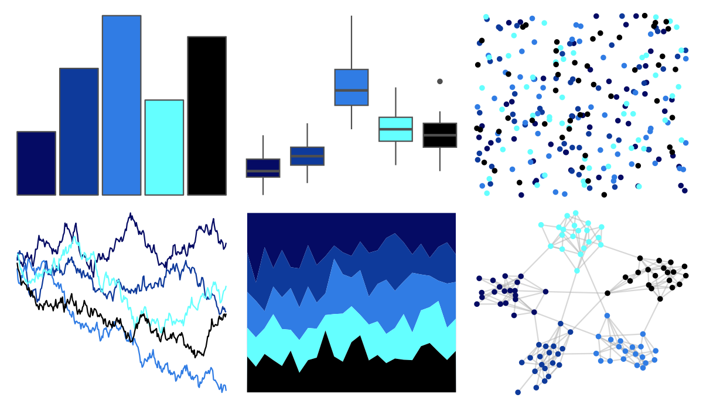

# trekcolors - black_alert 

::: columns
::: {.column width="50%"}

**Github**

[leonawicz/trekcolors](https://github.com/leonawicz/trekcolors)
:::

::: {.column width="50%"}

**CRAN**

[trekcolors](https://CRAN.R-project.org/package=trekcolors)
:::
:::

<hr> 

Use with [paletteer](https://emilhvitfeldt.github.io/paletteer/) package:

```r
library(paletteer)
paletteer_d("trekcolors::black_alert")
```

Use raw:

```r
c("#050B64FF", "#0E3A9BFF", "#307CE4FF", "#64FFFFFF", "#000000FF")
``` 

 

<br>

# Related Palettes

<div class="list" style="display: grid; grid-template-columns: auto auto auto;"> <figure class="figure">
<a href="../../amerika/Dem_Ind_Rep3/"> </a>
</figure> <figure class="figure">
<a href="../../tvthemes/LapisLazuli/"> </a>
</figure> <figure class="figure">
<a href="../../tvthemes/Aquamarine/"> </a>
</figure> <figure class="figure">
<a href="../../ggprism/blueprint/"> </a>
</figure> <figure class="figure">
<a href="../../Manu/Gloomy_Nudi/"> </a>
</figure> <figure class="figure">
<a href="../../tvthemes/Flourite/"> </a>
</figure> <figure class="figure">
<a href="../../ggprism/blueprint3/"> </a>
</figure> <figure class="figure">
<a href="../../nbapalettes/magic_city2/"> </a>
</figure> <figure class="figure">
<a href="../../tvthemes/Dark/"> </a>
</figure> <figure class="figure">
<a href="../../nbapalettes/bucks/"> </a>
</figure> <figure class="figure">
<a href="../../PrettyCols/Ocean/"> </a>
</figure> <figure class="figure">
<a href="../../feathers/cassowary/"> </a>
</figure> 
</div>
