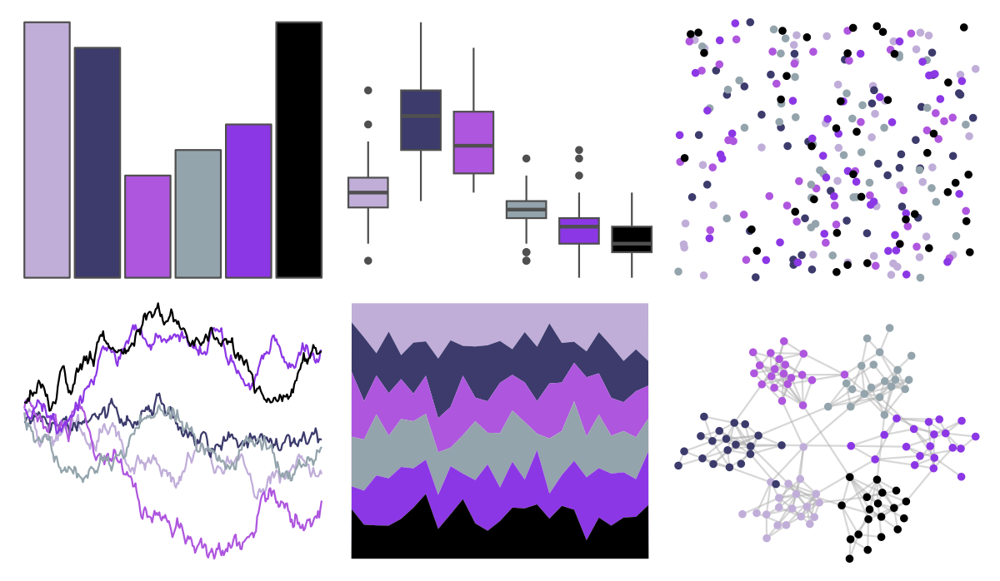
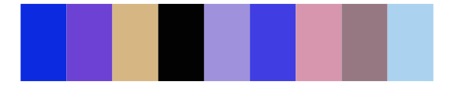

# tvthemes - Amethyst 

::: columns
::: {.column width="50%"}

**Github**

[Ryo-N7/tvthemes](https://github.com/Ryo-N7/tvthemes)
:::

::: {.column width="50%"}

**CRAN**

[tvthemes](https://CRAN.R-project.org/package=tvthemes)
:::
:::

<hr> 

Use with [paletteer](https://emilhvitfeldt.github.io/paletteer/) package:

```r
library(paletteer)
paletteer_d("tvthemes::Amethyst")
```

Use raw:

```r
c("#C0AED9FF", "#3C3B6CFF", "#AE56DEFF", "#94A4ACFF", "#8C37E5FF", "#000000FF")
``` 

 

<br>

# Related Palettes

<div class="list" style="display: grid; grid-template-columns: auto auto auto;"> <figure class="figure">
<a href="../../amerika/Dem_Ind_Rep3/"> </a>
</figure> <figure class="figure">
<a href="../../palettetown/wailord/"> </a>
</figure> <figure class="figure">
<a href="../../palettetown/quagsire/"> </a>
</figure> <figure class="figure">
<a href="../../peRReo/planb/"> </a>
</figure> <figure class="figure">
<a href="../../peRReo/badgyal/"> </a>
</figure> <figure class="figure">
<a href="../../palettetown/espeon/"> </a>
</figure> <figure class="figure">
<a href="../../NineteenEightyR/electronic_night/"> </a>
</figure> <figure class="figure">
<a href="../../tvthemes/Flourite/"> </a>
</figure> <figure class="figure">
<a href="../../feathers/cassowary/"> </a>
</figure> <figure class="figure">
<a href="../../tvthemes/Garnet/"> </a>
</figure> <figure class="figure">
<a href="../../palettetown/gligar/"> </a>
</figure> <figure class="figure">
<a href="../../palettetown/wynaut/"> </a>
</figure> 
</div>
