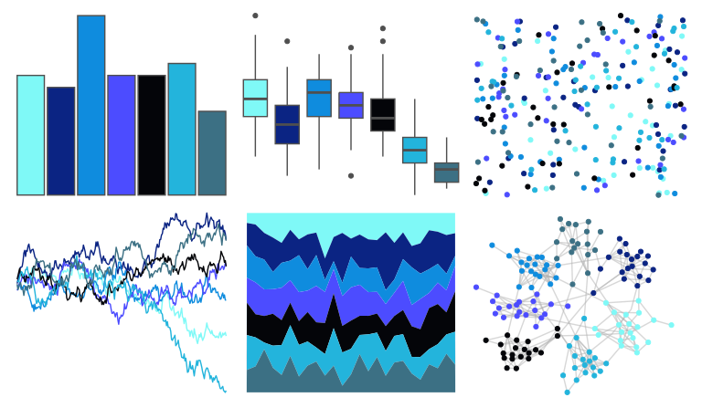

# tvthemes - Aquamarine 

::: columns
::: {.column width="50%"}

**Github**

[Ryo-N7/tvthemes](https://github.com/Ryo-N7/tvthemes)
:::

::: {.column width="50%"}

**CRAN**

[tvthemes](https://CRAN.R-project.org/package=tvthemes)
:::
:::

<hr> 

Use with [paletteer](https://emilhvitfeldt.github.io/paletteer/) package:

```r
library(paletteer)
paletteer_d("tvthemes::Aquamarine")
```

Use raw:

```r
c("#7FF9F7FF", "#0B2483FF", "#0F8CDEFF", "#4C4CFFFF", "#040509FF", "#23B4DCFF", "#3C7084FF")
``` 

 

<br>

# Related Palettes

<div class="list" style="display: grid; grid-template-columns: auto auto auto;"> <figure class="figure">
<a href="../../awtools/a_palette/"> </a>
</figure> <figure class="figure">
<a href="../../tvthemes/Flourite/"> </a>
</figure> <figure class="figure">
<a href="../../tvthemes/LapisLazuli/"> </a>
</figure> <figure class="figure">
<a href="../../trekcolors/black_alert/"> </a>
</figure> <figure class="figure">
<a href="../../palettetown/quagsire/"> </a>
</figure> <figure class="figure">
<a href="../../futurevisions/europa/"> </a>
</figure> <figure class="figure">
<a href="../../werpals/vatnajokull/"> </a>
</figure> <figure class="figure">
<a href="../../vapoRwave/jazzCup/"> </a>
</figure> <figure class="figure">
<a href="../../tvthemes/WaterTribe/"> </a>
</figure> <figure class="figure">
<a href="../../LaCroixColoR/Pure/"> </a>
</figure> <figure class="figure">
<a href="../../vapeplot/jazzcup/"> </a>
</figure> <figure class="figure">
<a href="../../colRoz/physalia/"> </a>
</figure> 
</div>
