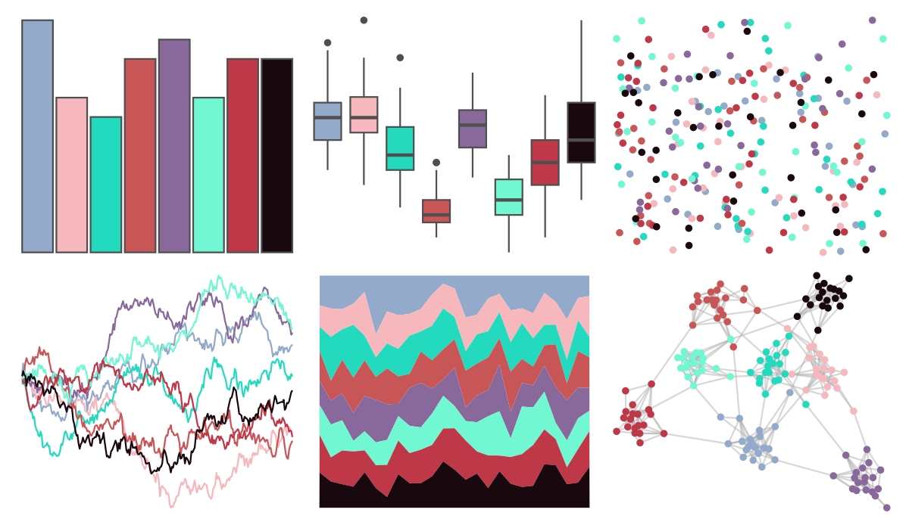

# tvthemes - Bismuth 

::: columns
::: {.column width="50%"}

**Github**

[Ryo-N7/tvthemes](https://github.com/Ryo-N7/tvthemes)
:::

::: {.column width="50%"}

**CRAN**

[tvthemes](https://CRAN.R-project.org/package=tvthemes)
:::
:::

<hr> 

Use with [paletteer](https://emilhvitfeldt.github.io/paletteer/) package:

```r
library(paletteer)
paletteer_d("tvthemes::Bismuth")
```

Use raw:

```r
c("#93AACAFF", "#F6B8BDFF", "#24DABEFF", "#C95657FF", "#89699CFF", "#71F8D3FF", "#BF3847FF", "#19090FFF")
``` 

 

<br>

# Related Palettes

<div class="list" style="display: grid; grid-template-columns: auto auto auto;"> <figure class="figure">
<a href="../../awtools/a_palette/"> </a>
</figure> <figure class="figure">
<a href="../../ButterflyColors/hamadryas_feronia/"> </a>
</figure> <figure class="figure">
<a href="../../ButterflyColors/hamadryas_feronia/"> </a>
</figure> <figure class="figure">
<a href="../../peRReo/karolg/"> </a>
</figure> <figure class="figure">
<a href="../../tvthemes/Stark/"> </a>
</figure> <figure class="figure">
<a href="../../ggsci/lanonc_lancet/"> </a>
</figure> <figure class="figure">
<a href="../../peRReo/buenavista/"> </a>
</figure> <figure class="figure">
<a href="../../rcartocolor/Safe/"> </a>
</figure> <figure class="figure">
<a href="../../palettetown/chimecho/"> </a>
</figure> <figure class="figure">
<a href="../../palettetown/porygon/"> </a>
</figure> <figure class="figure">
<a href="../../tvthemes/Garnet/"> </a>
</figure> <figure class="figure">
<a href="../../palettetown/minun/"> </a>
</figure> 
</div>
