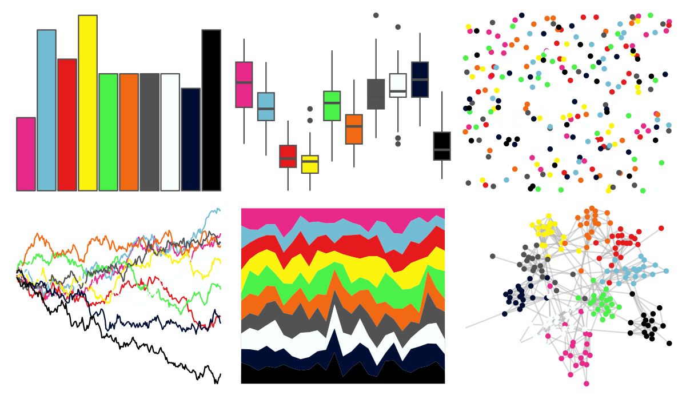

# tvthemes - Regular 

::: columns
::: {.column width="50%"}

**Github**

[Ryo-N7/tvthemes](https://github.com/Ryo-N7/tvthemes)
:::

::: {.column width="50%"}

**CRAN**

[tvthemes](https://CRAN.R-project.org/package=tvthemes)
:::
:::

<hr> 

Use with [paletteer](https://emilhvitfeldt.github.io/paletteer/) package:

```r
library(paletteer)
paletteer_d("tvthemes::Regular")
```

Use raw:

```r
c("#E7298AFF", "#72BCD4FF", "#E41A1CFF", "#FCF40EFF", "#49F149FF", "#F16913FF", "#525252FF", "#F9FEFFFF", "#000E33FF", "#000000FF")
``` 

 

<br>

# Related Palettes

<div class="list" style="display: grid; grid-template-columns: auto auto auto;"> <figure class="figure">
<a href="../../awtools/a_palette/"> </a>
</figure> <figure class="figure">
<a href="../../ButterflyColors/hamadryas_feronia/"> </a>
</figure> <figure class="figure">
<a href="../../ButterflyColors/hamadryas_feronia/"> </a>
</figure> <figure class="figure">
<a href="../../tvthemes/bigHero6/"> </a>
</figure> <figure class="figure">
<a href="../../ochRe/healthy_reef/"> </a>
</figure> <figure class="figure">
<a href="../../colorblindr/OkabeIto_black/"> </a>
</figure> <figure class="figure">
<a href="../../khroma/okabeitoblack/"> </a>
</figure> <figure class="figure">
<a href="../../tvthemes/gravityFalls/"> </a>
</figure> <figure class="figure">
<a href="../../tvthemes/spongeBob/"> </a>
</figure> <figure class="figure">
<a href="../../tvthemes/kimPossible/"> </a>
</figure> <figure class="figure">
<a href="../../ggsci/springfield_simpsons/"> </a>
</figure> <figure class="figure">
<a href="../../palettetown/yanma/"> </a>
</figure> 
</div>
