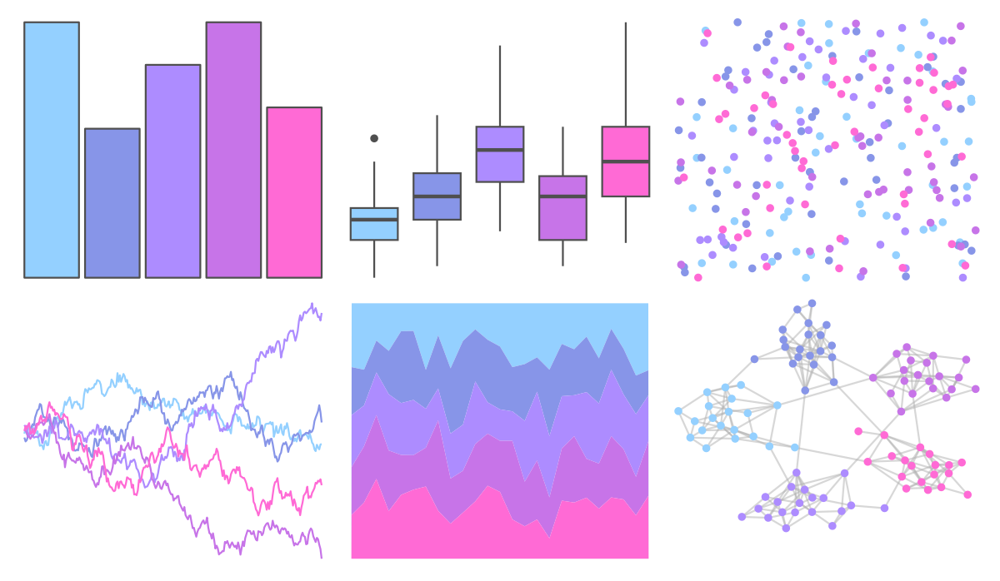

# vapoRwave - cool 

::: columns
::: {.column width="50%"}

**Github**

[moldach/vapoRwave](https://github.com/moldach/vapoRwave)
:::

::: {.column width="50%"}

**CRAN**

Not on CRAN
:::
:::

<hr> 

Use with [paletteer](https://emilhvitfeldt.github.io/paletteer/) package:

```r
library(paletteer)
paletteer_d("vapoRwave::cool")
```

Use raw:

```r
c("#94D0FFFF", "#8795E8FF", "#AD8CFFFF", "#C774E8FF", "#FF6AD5FF")
``` 

 

<br>

# Related Palettes

<div class="list" style="display: grid; grid-template-columns: auto auto auto;"> <figure class="figure">
<a href="../../awtools/a_palette/"> </a>
</figure> <figure class="figure">
<a href="../../vapeplot/cool/"> </a>
</figure> <figure class="figure">
<a href="../../ggthemes/excel_Red_Violet/"> </a>
</figure> <figure class="figure">
<a href="../../ggprism/pastels/"> </a>
</figure> <figure class="figure">
<a href="../../rcartocolor/Purp/"> </a>
</figure> <figure class="figure">
<a href="../../ggthemes/excel_Violet_II/"> </a>
</figure> <figure class="figure">
<a href="../../ggthemes/excel_Gallery/"> </a>
</figure> <figure class="figure">
<a href="../../fishualize/Scarus_globiceps/"> </a>
</figure> <figure class="figure">
<a href="../../beyonce/X111/"> </a>
</figure> <figure class="figure">
<a href="../../ggprism/winter_soft/"> </a>
</figure> <figure class="figure">
<a href="../../wesanderson/GrandBudapest2/"> </a>
</figure> <figure class="figure">
<a href="../../vapoRwave/avanti/"> </a>
</figure> 
</div>
