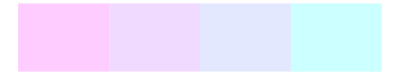

# vapoRwave - crystalPepsi 

::: columns
::: {.column width="50%"}

**Github**

[moldach/vapoRwave](https://github.com/moldach/vapoRwave)
:::

::: {.column width="50%"}

**CRAN**

Not on CRAN
:::
:::

<hr> 

Use with [paletteer](https://emilhvitfeldt.github.io/paletteer/) package:

```r
library(paletteer)
paletteer_d("vapoRwave::crystalPepsi")
```

Use raw:

```r
c("#CCFFFFFF", "#E3E8FFFF", "#F1DAFFFF", "#FFCCFFFF")
``` 

 

<br>

# Related Palettes

<div class="list" style="display: grid; grid-template-columns: auto auto auto;"> <figure class="figure">
<a href="../../awtools/a_palette/"> </a>
</figure> <figure class="figure">
<a href="../../vapeplot/crystal_pepsi/"> </a>
</figure> <figure class="figure">
<a href="../../vapoRwave/mallSoft/"> </a>
</figure> <figure class="figure">
<a href="../../vapeplot/mallsoft/"> </a>
</figure> <figure class="figure">
<a href="../../unikn/pal_seeblau/"> </a>
</figure> <figure class="figure">
<a href="../../unikn/pal_peach/"> </a>
</figure> <figure class="figure">
<a href="../../khroma/pale/"> </a>
</figure> <figure class="figure">
<a href="../../miscpalettes/light/"> </a>
</figure> <figure class="figure">
<a href="../../PNWColors/Spring/"> </a>
</figure> <figure class="figure">
<a href="../../wesanderson/GrandBudapest2/"> </a>
</figure> <figure class="figure">
<a href="../../RColorBrewer/Pastel1/"> </a>
</figure> <figure class="figure">
<a href="../../RColorBrewer/Pastel2/"> </a>
</figure> 
</div>
