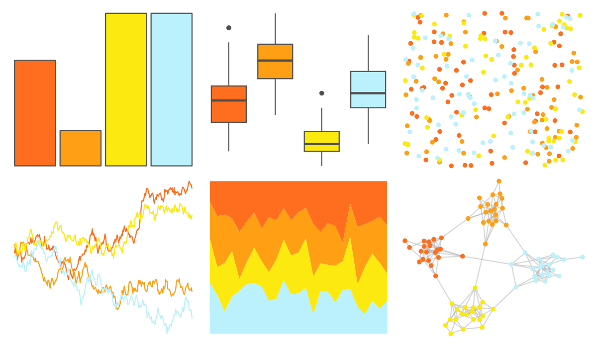

# waRhol - camo_87_4 

::: columns
::: {.column width="50%"}

**Github**

[alexskeels/waRhol](https://github.com/alexskeels/waRhol)
:::

::: {.column width="50%"}

**CRAN**

Not on CRAN
:::
:::

<hr> 

Use with [paletteer](https://emilhvitfeldt.github.io/paletteer/) package:

```r
library(paletteer)
paletteer_d("waRhol::camo_87_4")
```

Use raw:

```r
c("#FF6E1EFF", "#FE9F14FF", "#FCE90FFF", "#BBF1FCFF")
``` 

 

<br>

# Related Palettes

<div class="list" style="display: grid; grid-template-columns: auto auto auto;"> <figure class="figure">
<a href="../../amerika/Dem_Ind_Rep3/"> </a>
</figure> <figure class="figure">
<a href="../../lisa/BridgetRiley/"> </a>
</figure> <figure class="figure">
<a href="../../khroma/incandescent/"> </a>
</figure> <figure class="figure">
<a href="../../fishualize/Salmo_salar/"> </a>
</figure> <figure class="figure">
<a href="../../MoMAColors/Connors/"> </a>
</figure> <figure class="figure">
<a href="../../waRhol/skull_86/"> </a>
</figure> <figure class="figure">
<a href="../../khroma/YlOrBr/"> </a>
</figure> <figure class="figure">
<a href="../../RColorBrewer/YlOrBr/"> </a>
</figure> <figure class="figure">
<a href="../../MetBrewer/Tara/"> </a>
</figure> <figure class="figure">
<a href="../../NineteenEightyR/miami1/"> </a>
</figure> <figure class="figure">
<a href="../../poisonfrogs/Dsarayacuensis/"> </a>
</figure> <figure class="figure">
<a href="../../waRhol/skull_76_1/"> </a>
</figure> 
</div>
