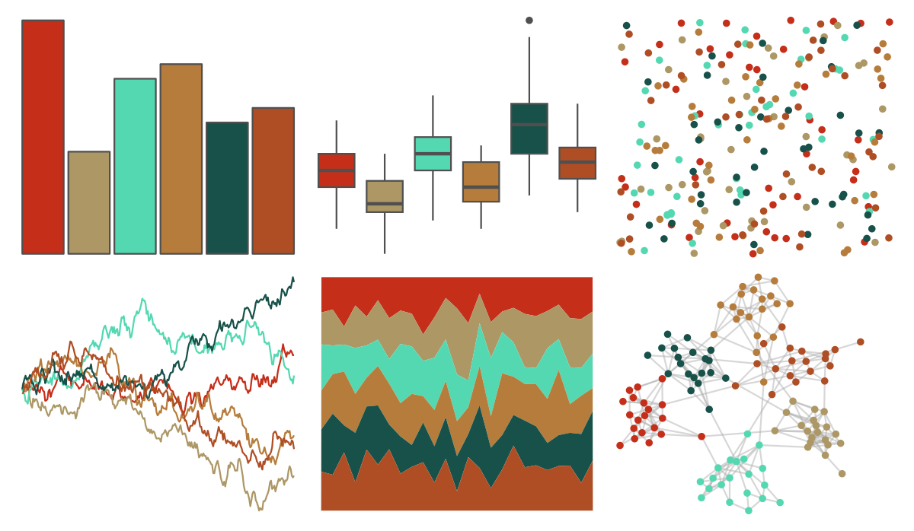
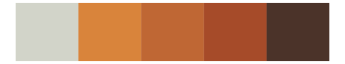
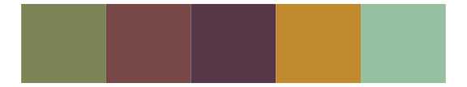

# wesanderson - AsteroidCity2 

::: columns
::: {.column width="50%"}

**Github**

[karthik/wesanderson](https://github.com/karthik/wesanderson)
:::

::: {.column width="50%"}

**CRAN**

[wesanderson](https://CRAN.R-project.org/package=wesanderson)
:::
:::

<hr> 

Use with [paletteer](https://emilhvitfeldt.github.io/paletteer/) package:

```r
library(paletteer)
paletteer_d("wesanderson::AsteroidCity2")
```

Use raw:

```r
c("#C52E19FF", "#AC9765FF", "#54D8B1FF", "#B67C3BFF", "#175149FF", "#AF4E24FF")
``` 

 

<br>

# Related Palettes

<div class="list" style="display: grid; grid-template-columns: auto auto auto;"> <figure class="figure">
<a href="../../amerika/Dem_Ind_Rep3/"> </a>
</figure> <figure class="figure">
<a href="../../ButterflyColors/lycorea_hallia/"> </a>
</figure> <figure class="figure">
<a href="../../DresdenColor/sidejobs/"> </a>
</figure> <figure class="figure">
<a href="../../DresdenColor/graveperil/"> </a>
</figure> <figure class="figure">
<a href="../../fishualize/Pseudocheilinus_tetrataenia/"> </a>
</figure> <figure class="figure">
<a href="../../fishualize/Pterois_volitans/"> </a>
</figure> <figure class="figure">
<a href="../../DresdenColor/bloodrites/"> </a>
</figure> <figure class="figure">
<a href="../../ButterflyColors/danaus_gilippus/"> </a>
</figure> <figure class="figure">
<a href="../../fishualize/Parablennius_marmoreus/"> </a>
</figure> <figure class="figure">
<a href="../../fishualize/Epinephelus_marginatus/"> </a>
</figure> <figure class="figure">
<a href="../../poisonfrogs/Opescudo/"> </a>
</figure> <figure class="figure">
<a href="../../ButterflyColors/anteos_menippe/"> </a>
</figure> 
</div>
