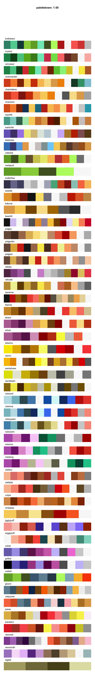
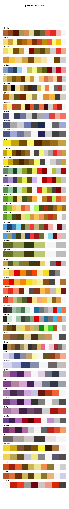
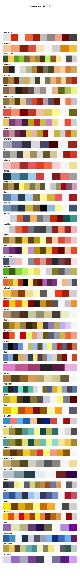
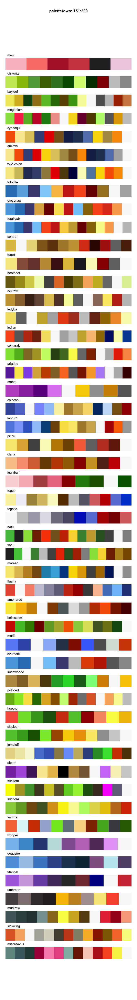
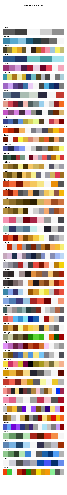
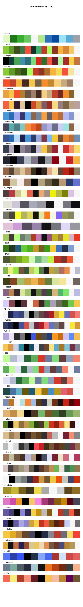
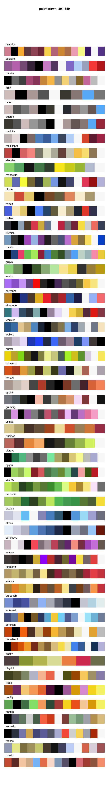
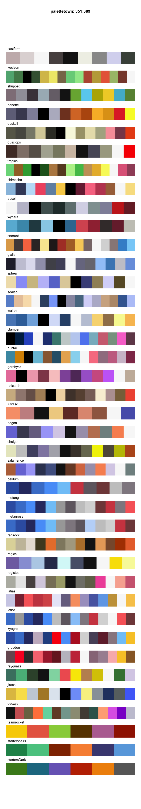

<!-- README.md is generated from README.Rmd. Please edit that file -->

# Table of Contents

  - [Main page](README.md#comprehensive-list-of-color-palettes-in-r)
  - [Blogposts and other
    resources](README.md#blogposts-and-other-resources)
  - [Generative packages](README.md#generative-packages)
  - [Honorable mentions](README.md#honorable-mentions)
  - [Palettes sorted by Package
    (alphabetically)](README.md#palettes-sorted-by-package-alphabetically)
      - [Sequential color palettes](#sequential-color-palettes)
      - [Diverging color palettes](#diverging-color-palettes)
      - [Qualitative color palettes](#qualitative-color-palettes)
      - [Canva palettes](canva.md)
      - [Palettetown palettes](palettetown.md)
  - [News](NEWS.md)

## Palettetown palettes

<!-- -->

<!-- -->

<!-- -->

<!-- -->

<!-- -->

<!-- -->

<!-- -->

<!-- -->
