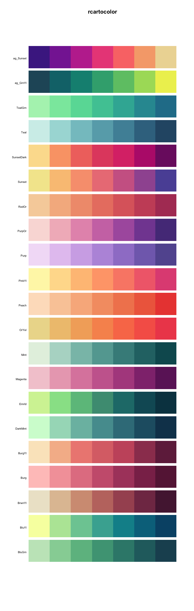
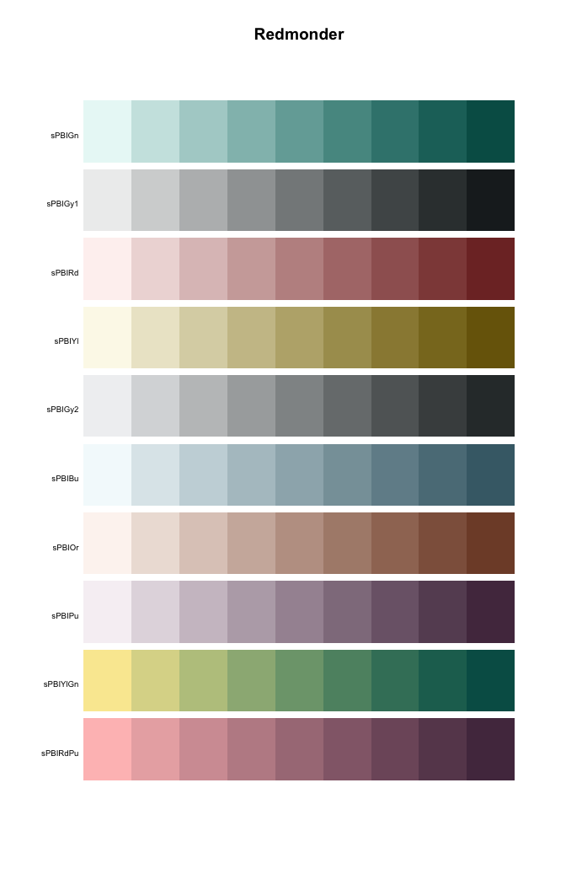

<!-- README.md is generated from README.Rmd. Please edit that file -->
Comprehensive list of color palettes available in r
===================================================

Palettes sorted by type (Sequential/Diverging/Qualitative)
----------------------------------------------------------

### Sequential color palettes

